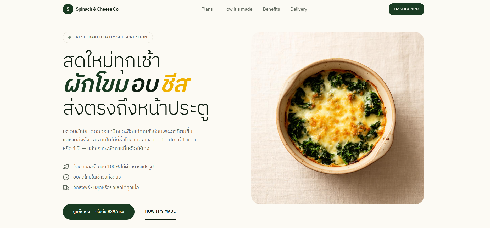

# Spinach & Cheese Co.



Thai-language landing page and dashboard for a spinach-and-cheese bake subscription service ("ผักโขมอบชีส"), built with Nuxt 4 + Vue 3 + TypeScript + Tailwind CSS v4.

## Tech Stack

- **Framework:** Nuxt 4, Vue 3 (Composition API, `<script setup lang="ts">`)
- **Styling:** Tailwind CSS v4, `tw-animate-css`
- **UI:** shadcn-vue (New York style), Reka UI, Lucide icons
- **Auth:** Better Auth
- **Animations:** `@vueuse/core` IntersectionObserver + CSS transitions

## Features

- Landing page with plan selection (weekly/monthly/yearly)
- Scroll-reveal animations via `<RevealSection>` wrapper component
- Checkout flow with auto-fill Thai mock data
- Dashboard for subscription management (cancel, change plan)
- HEIC image support

## Setup

```bash
bun install
```

## Development

```bash
bun run dev
```

Opens at `http://localhost:3000`.

## Commands

| Command | Description |
|---------|-------------|
| `bun run dev` | Start dev server with HMR |
| `bun run build` | Production build |
| `bun run preview` | Preview production build |
| `bun run generate` | Generate static site |
| `bun run postinstall` | Generate Nuxt types (needed before type-check) |
| `bun x vue-tsc --noEmit` | Run type-check |

## Project Structure

```
app/
├── assets/css/styles.css     — Global styles, Tailwind, design tokens
├── components/
│   ├── landing/              — Landing page sections
│   ├── SiteHeader.vue        — Sticky header with nav
│   ├── SiteFooter.vue        — Footer
│   └── RevealSection.vue     — Scroll-reveal animation wrapper
├── composables/
│   └── plans.ts              — Plan definitions, pricing, images
├── lib/
│   └── utils.ts              — cn() utility for class merging
└── pages/
    ├── index.vue             — Landing page
    └── dashboard.vue         — Subscription dashboard
```

## Design Decisions

- All UI text is in Thai (English labels for navigation)
- Plans data is centralized in `composables/plans.ts` with THB pricing
- Scroll-reveal animations use IntersectionObserver (via `@vueuse/core`) + pure CSS transitions
- Sections respect `prefers-reduced-motion: reduce`
- `scroll-behavior: smooth` + `scroll-padding-top` for smooth navbar hash scrolling
